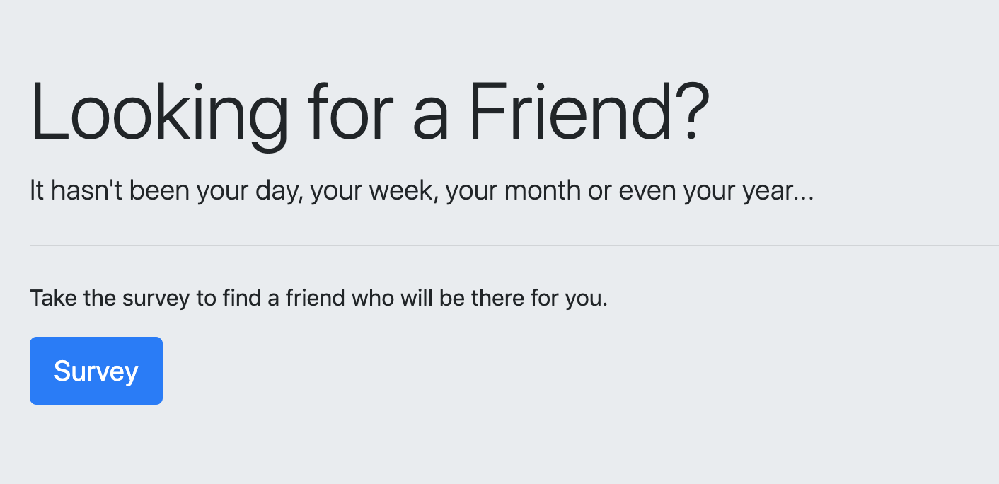
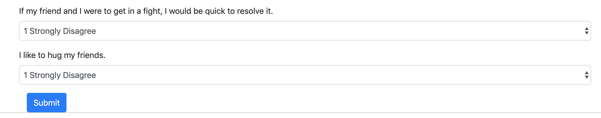
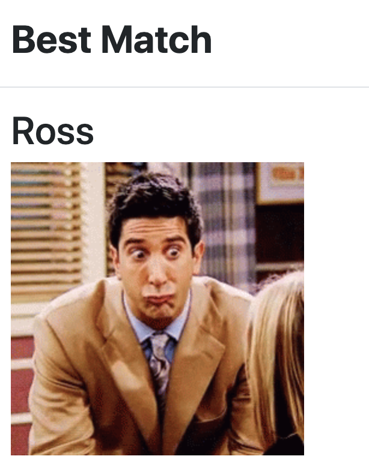

# FriendFinder
* For: UNH Portsmouth Coding Bootcamp
* Student: Maria Shady
* Built with: Nodejs, JavaScript, JQuery, Express

## Description:
A "Friends" themed Express application that collects information from the user with a survery and finds the best match within the database. 

